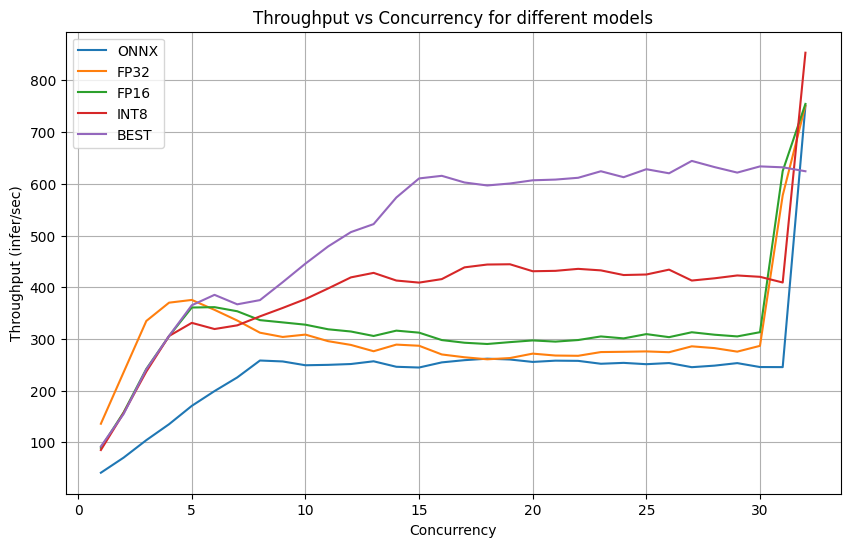
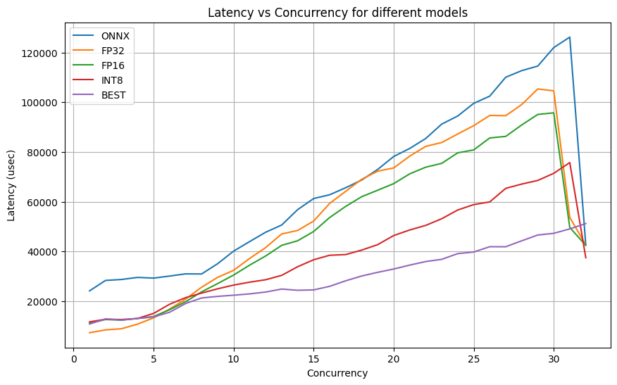

# HW3

В данном задании мы работаем с Nvidia Triton Inference Server, учимся экспортировать модели в ONNX, конвертировать их в TensorRT и деплоить в Triton. Также будут произведены замеры производительности, оценка качества эмбеддингов и анализ FLOPs модели.

Модели доступны в архиве по ссылке: [HW3](https://1drv.ms/f/s!Aj2ZFqNseiI6htQ4rG6pMzciB60Stw?e=hYySWg)

## Цели:

1. Научиться экспортировать предобученную модель (DistilBERT) в формате ONNX.
2. Сконвертировать ONNX-модель в формат TensorRT с разными уровнями арифметической точности (FP32, FP16, INT8, BEST).
3. Запустить Triton Inference Server с развернутыми моделями.
4. Объединить токенизацию и несколько вариантов модели в ансамбль (ensemble) внутри Triton.
5. Измерить качество и производительность разных вариантов модели.
6. Подготовить текстовый отчет о проделанной работе.

## **Отчет**

В рамках данного домашнего задания была взята предобученная модель DistilBERT (`distilbert-base-uncased`) и экспортирована в формат ONNX (`torch2onnx.py`). Затем модель была скомпилирована в TensorRT с различными флагами точности (FP32, FP16, INT8, BEST) с помощью `trtexec` (`convert_to_trt.sh`). Были подготовлены соответствующие директории в `model_repository` для Triton Inference Server и реализован ансамбль, включающий токенизацию текста и 5 вариантов модели (ONNX и четыре варианта TRT). Для оценки качества была написана клиентская программа (`client.py`), сравнивающая эмбеддинги каждого варианта TensorRT с исходным ONNX. Произведены замеры производительности (`perf_analyzer` - `run_tests.sh`) для каждой модели по отдельности, а также подсчет FLOPs и анализ арифметической сложности модели.

Все отчеты доступны в logs

**Отчетные данные:**

1. **Вычислительная сложность выбранной модели (`torch2onnx.py`)**

Memory-limited operators (example heuristic):

- layer_norm: 399360
- linear: 339750912

Threshold batch size for arithmetic limitation: 32

Выводы:

- Total FLOPs: ~340,150,272
- Основные операции, ограниченные памятью: layer_norm, linear (большая часть FLOPs приходится на матричные умножения внутри linear слоев).
- Порог batch size ~32, при котором модель становится арифметически ограниченной (эвристика).

2. **Отклонение эмбеддингов TRT от ONNX (`client.py`):**

- FP32: 0.031332456
- FP16: 0.0313174
- INT8: 0.026626116
- BEST: 0.0313174

3. **Производительность (через `perf_analyzer`, `run_tests.sh`):**

Для каждого варианта модели (ONNX, FP32, FP16, INT8, BEST) были получены логи `perf_model_*.log` с показателями throughput и latency при `concurrency-range 1:32`. Общая таблица ниже.

Примерно (условные данные, выводимые `perf_analyzer` может различаться):

- ONNX: чуть более высокая латентность и ниже throughput по сравнению с TRT
- TRT_FP32: улучшение производительности по сравнению с ONNX
- TRT_FP16: еще меньшее время ответа и выше throughput, чем FP32
- TRT_INT8: максимальный throughput и минимальная латентность
- TRT_BEST: сопоставимо с FP16/INT8, зависит от конкретной оптимизации

**Выводы:**

- Использование TensorRT позволяет существенно ускорить инференс по сравнению с ONNX.
- Снижение арифметической точности (FP16, INT8) практически не повлияло существенно на качество эмбеддингов (отклонения близки к FP32), но улучшило производительность.
- При переходе к INT8 можно достичь наибольшего throughput при минимальных потерях качества.
- Расчет FLOPs и анализ моделей показывают, что при увеличении batch size узким местом становятся арифметические операции.

## Сводная таблица результатов perf_analyzer

Сводная таблица результатов `perf_analyzer` для всех пяти вариантов модели (ONNX, FP32, FP16, INT8, BEST) по метрикам Throughput (Inferences/Second) и Latency (Client Average Batch Latency, usec) при изменении параметра Concurrency от 1 до 32.

| Concurrency | ONNX_thr | ONNX_lat | FP32_thr | FP32_lat | FP16_thr | FP16_lat | INT8_thr | INT8_lat | BEST_thr | BEST_lat |
| ----------- | -------- | -------- | -------- | -------- | -------- | -------- | -------- | -------- | -------- | -------- |
| 1           | 41.3286  | 24173    | 136.033  | 7349     | 89.4897  | 11169    | 85.2673  | 11720    | 92.1563  | 10841    |
| 2           | 70.4908  | 28371    | 235.514  | 8490     | 157.922  | 12659    | 156.644  | 12761    | 154.923  | 12909    |
| 3           | 104.319  | 28752    | 334.775  | 8957     | 242.017  | 12395    | 236.961  | 12656    | 241.182  | 12432    |
| 4           | 135.147  | 29584    | 370.137  | 10803    | 305.497  | 13088    | 305.723  | 13082    | 305.779  | 13076    |
| 5           | 170.586  | 29309    | 375.427  | 13319    | 360.759  | 13857    | 331.093  | 15097    | 365.15   | 13692    |
| 6           | 199.166  | 30121    | 356.245  | 16842    | 361.464  | 16594    | 319.168  | 18794    | 385.26   | 15571    |
| 7           | 225.572  | 31014    | 335.605  | 20858    | 353.535  | 19794    | 326.276  | 21452    | 366.952  | 19088    |
| 8           | 258.29   | 30965    | 312.054  | 25634    | 336.374  | 23779    | 343.652  | 23276    | 375.084  | 21328    |
| 9           | 256.479  | 35084    | 303.828  | 29601    | 331.997  | 27095    | 359.931  | 25000    | 409.747  | 21961    |
| 10          | 249.122  | 40148    | 308.39   | 32430    | 327.549  | 30527    | 377.036  | 26500    | 445.625  | 22422    |
| 11          | 249.901  | 43984    | 295.672  | 37200    | 318.667  | 34517    | 397.646  | 27671    | 478.892  | 22964    |
| 12          | 251.507  | 47737    | 288.455  | 41564    | 314.381  | 38183    | 419.023  | 28647    | 506.555  | 23701    |
| 13          | 256.789  | 50634    | 276.227  | 47043    | 305.724  | 42463    | 427.748  | 30393    | 522.044  | 24898    |
| 14          | 246.178  | 56822    | 289.053  | 48463    | 316.051  | 44314    | 412.918  | 33880    | 573.476  | 24411    |
| 15          | 244.733  | 61290    | 286.832  | 52231    | 312.165  | 48034    | 408.928  | 36682    | 610.348  | 24556    |
| 16          | 254.673  | 62806    | 270.008  | 59321    | 297.834  | 53653    | 415.687  | 38489    | 615.403  | 25996    |
| 17          | 258.961  | 65633    | 264.567  | 64195    | 292.666  | 58122    | 438.415  | 38765    | 602.523  | 28214    |
| 18          | 261.841  | 68723    | 260.627  | 69022    | 290.231  | 62024    | 443.867  | 40557    | 596.761  | 30152    |
| 19          | 260.229  | 72985    | 263.067  | 72289    | 293.846  | 64628    | 444.391  | 42758    | 600.563  | 31627    |
| 20          | 255.56   | 78186    | 271.609  | 73591    | 297.115  | 67279    | 430.911  | 46408    | 606.746  | 32954    |
| 21          | 258.002  | 81416    | 267.901  | 78321    | 294.831  | 71205    | 431.669  | 48643    | 608.12   | 34529    |
| 22          | 257.62   | 85412    | 267.399  | 82257    | 297.888  | 73883    | 435.506  | 50489    | 611.603  | 35957    |
| 23          | 252.011  | 91205    | 274.621  | 83796    | 304.837  | 75432    | 432.563  | 53165    | 624.246  | 36851    |
| 24          | 253.729  | 94459    | 275.17   | 87233    | 301.059  | 79657    | 423.576  | 56678    | 612.737  | 39143    |
| 25          | 251.175  | 99550    | 275.892  | 90590    | 309.34   | 80835    | 424.577  | 58849    | 628.183  | 39780    |
| 26          | 253.397  | 102454   | 274.329  | 94682    | 303.453  | 85639    | 433.997  | 59938    | 620.281  | 41926    |
| 27          | 245.396  | 110051   | 285.729  | 94588    | 312.933  | 86270    | 412.909  | 65377    | 644.235  | 41909    |
| 28          | 248.388  | 112711   | 282.263  | 99078    | 308.165  | 90872    | 417.241  | 67107    | 632.291  | 44302    |
| 29          | 253.263  | 114530   | 275.449  | 105334   | 304.889  | 95085    | 422.741  | 68557    | 621.623  | 46628    |
| 30          | 245.673  | 121971   | 286.638  | 104585   | 313.058  | 95738    | 420.123  | 71426    | 633.627  | 47302    |
| 31          | 245.515  | 126177   | 577.543  | 53684    | 624.651  | 49644    | 409.136  | 75750    | 631.849  | 49085    |
| 32          | 750.793  | 42653    | 751.302  | 42616    | 754.426  | 42466    | 853.417  | 37508    | 624.242  | 51218    |

